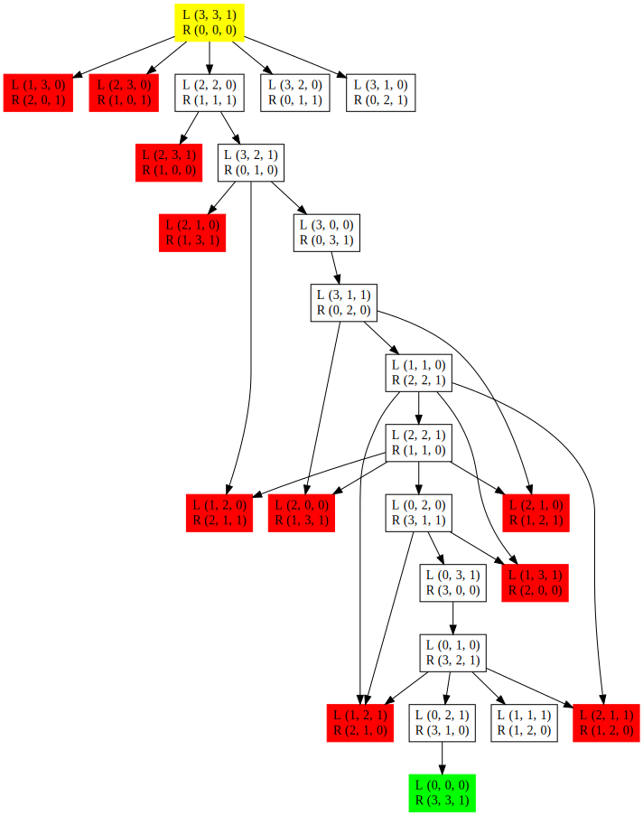

# Assignment Problem 2: Missionaries and Cannibals Problem

## Missionaries and Cannibals Problem - Execution Instructions

### Files:

- [Makefile](makefile)
- [MandCP.h](MandCP.h)
- [MandCP.cpp](MandCP.cpp)
- [main.cpp](main.cpp)

### Instructions:

1. **Download Files:**
   - Download the files [Makefile](makefile), [MandCP.h](MandCP.h), [MandCP.cpp](MandCP.cpp), and [main.cpp](main.cpp).
   - Place all files in a directory of your choice.

2. **Open Terminal or Command Prompt:**
   - Open a terminal or command prompt in the directory where you placed the files.

3. **Run Makefile:**
   - Execute the following command to build the program using the Makefile.

```bash
make
```

   This command compiles the code and generates the executable.

4. **Run Executable:**
   - Once the `make` command completes successfully, run the generated executable from the terminal.

```zsh
./mission_cannibals
```

### Notes:
- Ensure you have a C++ compiler installed (e.g., `g++` for GNU Compiler Collection).
- Check the Makefile for any specific instructions or dependencies.
- If you encounter issues, review error messages or share them for further assistance.

## Problem Description

The missionaries and cannibals problem is usually stated as follows. Three missionaries and three cannibals are on one side of a river, along with a boat that can hold one or two people. Find a way to get everyone to the other side without ever leaving a group of missionaries in one place outnumbered by the cannibals in that place. This problem is famous in AI because it was the subject of the first paper that approached problem formulation from an analytical viewpoint (Amarel, 1968).
## Questions:
1. Formulate the problem precisely, making only those distinctions necessary to ensure a valid solution. Draw a diagram of the complete state space.
2. Implement and solve the problem optimally using an appropriate search algorithm. Is it a good idea to check for repeated states?
3. Why do you think people have a hard time solving this puzzle, given that the state space is so simple?

##  Solution:
### Problem 1:
> #### Formulate the problem precisely, making only those distinctions necessary to ensure a valid solution. Draw a diagram of the complete state space.

#### Problem Formulation:
- M: Number of missionaries on the left side of the river.
- C: Number of cannibals on the left side of the river.
- B: Boat position (B is boat is present, for the left tuple if there is B then boat is on the left side and if blank then the boat is on the right side and and for the right side vise versa).

A state can be represented as a tuple (M, C, B).

Actions:
(m, c): Move m missionaries and c cannibals across the river.

Here is teh state space tree:




### Problem 2:
> #### Implement and solve the problem optimally using an appropriate search algorithm. Is it a good idea to check for repeated states?

Here is the solution for [Missionaries and Cannibals Problem](main.cpp).

BFS can handle the repeated state space by including all the unique states in a set and check if the state is already visited or not.

### Output

Output is given as below.
```bash
Initial State: 
(3, 3, 1) (0, 0, 0) Level: 0
(3, 2, 0) (0, 1, 1) Level: 1
(3, 1, 0) (0, 2, 1) Level: 1
(2, 2, 0) (1, 1, 1) Level: 1
(3, 2, 1) (0, 1, 0) Level: 2
(3, 0, 0) (0, 3, 1) Level: 3
(3, 1, 1) (0, 2, 0) Level: 4
(1, 1, 0) (2, 2, 1) Level: 5
(2, 2, 1) (1, 1, 0) Level: 6
(0, 2, 0) (3, 1, 1) Level: 7
(0, 3, 1) (3, 0, 0) Level: 8
(0, 1, 0) (3, 2, 1) Level: 9
(0, 2, 1) (3, 1, 0) Level: 10
(1, 1, 1) (2, 2, 0) Level: 10
(0, 0, 0) (3, 3, 1) Level: 11
(0, 0, 0) (3, 3, 1) Level: 12
Goal state found!
Total moves: 11
```

### Problem 3:
> #### Why do you think people have a hard time solving this puzzle, given that the state space is so simple?

In my opinion, the problem is not difficult to solve. When I finally understood the state space representation, which had been confusing me, the task became simple for me.

